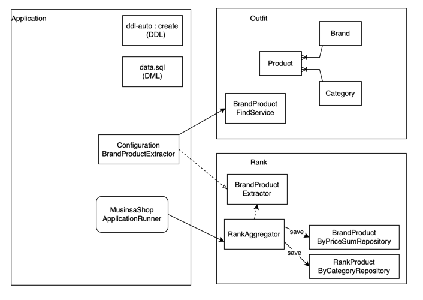
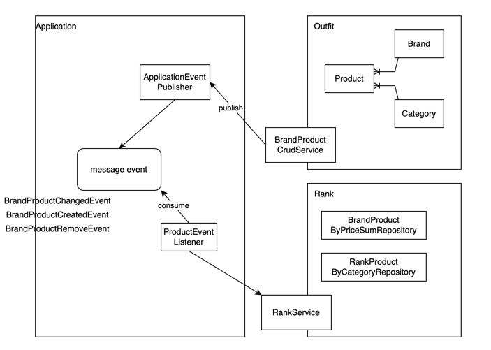

## 기능 구현

---
- 고객은 카테고리 별로 최저가격인 브랜드와 가격을 조회하고 총액이 얼마인지 확인
  ~~~
  GET /api/rank/products/lowest-by-category 
  ~~~
- 고객은 단일 브랜드로 전체 카테고리 상품을 구매할 경우 최저가격인 브랜드와 총액이 얼마인지 확인
  ~~~
  GET /api/rank/brand/lowest-price-sum
  ~~~
- 고객은 특정 카테고리에서 최저가격 브랜드와 최고가격 브랜드를 확인하고 각 브랜드 상품의 가격을 확인
  ~~~
  GET /api/rank/brand/lowest-price-sum
  ~~~
### 구현

- data.sql 로 구동 시 상품 데이터를 세팅하였고 ApplicationRunner 로 조회를 위한 데이터를 수집(Aggregator)했습니다.

---

- 운영자는 새로운 브랜드를 등록하고, 모든 브랜드의 상품을 추가, 변경, 삭제  
  ~~~  
  추가 POST   /api/brand/products
  변경 PUT    /api/brand/products
  삭제 DELETE /api/brand/products
  ~~~ 
### 구현

- 브랜드, 상품에 대한 변경사항이 발생할때 이벤트 발행 및 구독으로 데이터를 수집했습니다.

--- 

## 프로젝트 빌드 및 실행
#### 빌드
``` bash
./gradlew bootJar  
```

#### 테스트
``` bash
./gradlew test
```

#### 실행
``` bash
java -Dspring.profiles.active=local -jar ./build/libs/musinsa-0.0.1-SNAPSHOT.jar
```


--- 
### API DOC - SWAGGER UI 
~~~
  http://localhost:8000/swagger-ui/index.html
~~~

